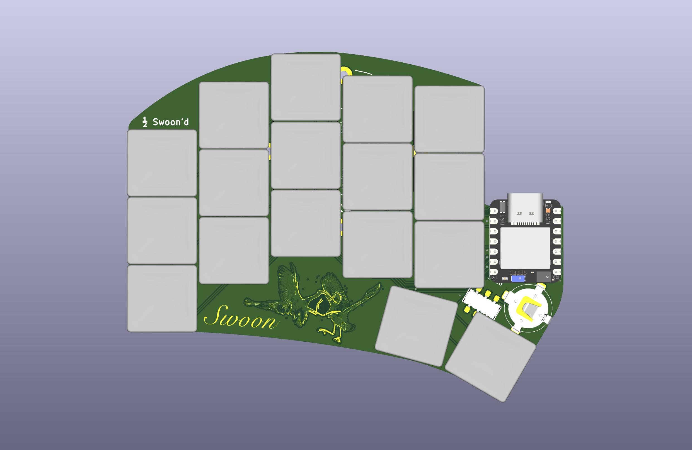

# Swoon Half Xiao'd

> Yet another diode matrix rework of the
> [Ferris Sweep Half Swept](https://github.com/davidphilipbarr/Sweep/tree/main/Sweep%20half-swept)
> for
> [Seeed Xiao nRF52840](https://www.seeedstudio.com/Seeed-XIAO-BLE-nRF52840-p-5201.html).

## Motivations

- Utilise Seeed Xiao—it's cuter
- Experiment with parts consignment for PCBA of hotswaps
- Choose a battery that can be easily changed by users who do not solder
  (LIR1254)
- Explore using CI/CD for board variants, case, and top plate generation
- Locate each half's components on its respective top side for more affordable
  assembly and lower overall height

> [!NOTE]
> In a Hurry? Here are the relevant links for download. No need scroll...
>
> Boards [[flip](/jlcpcb/swoon_FLIP.zip)] [[left](/jlcpcb/swoon_LEFT.zip)]
> [[right](/jlcpcb/swoon_RIGHT.zip)] [[both](/jlcpcb/swoon_BOTH.zip)]
>
> Case
> [[step](https://nightly.link/willpuckett/Swoon/actions/runs/10987780383/Case_STEP.zip)]
> [[stl](https://nightly.link/willpuckett/Swoon/actions/runs/10987780383/Case_STL.zip)]
>
> Firmware
> [[latest ZMK Builds](https://nightly.link/willpuckett/Swoon/workflows/zmk/main/swoon.zip)]

## Variants

[^1]

### **Flip**

> [!IMPORTANT]
> You'll need to solder the upward facing jumpers on each half under the Xiao
> before use.

A flippable variant [[flip](/jlcpcb/swoon_FLIP.zip)] for hand-soldering, like
the original half-swept. **Flip** is also the most cost conscious variant—about
$7.60 to get 5 of the boards produced, enough for 2 full keyboads and a nice...
coaster?

> [!CAUTION]
> Use 3.7v LIR1254 (lithium ion rechargable) battery **only**.

#### BOM

|      QTY      |                   Part                    | JLCPCB Part # |
| :-----------: | :---------------------------------------: | :-----------: |
|       2       |          0906-2-15-20-75-14-11-0          |   C5261048    |
|       2       |            BAT-SMD_MY-LR44-02             |   C2902345    |
|       4       | 310-13-107-41-001000 or MF254V-11-07-0743 |   C5504401    |
| 68 (optional) |          3305-0-15-80-47-27-10-0          |   C17370797   |
|       2       |               MST22D18G2125               |   C2906280    |
|      34       | CD4148WS (or 1N4148 SOD-323 from Amazon)  |   C38587762   |
|      34       |      Your ChocV1 switches of choice       |      N/A      |
|       2       |         3.7V LIR1254 (NOT LR44!)          |      N/A      |

### **Left** and **Right**

These variants are designed to be produced and assembled by JLCPCB. Each zip
file [[left](/jlcpcb/swoon_LEFT.zip)] [[right](/jlcpcb/swoon_RIGHT.zip)] has the
a gerbers/drill zip, a cpl, and bom file. They should be fully assemblable, but
you'll need to preorder the parts through global sourcing before paying. The
3305s aren't cheap and they cost extra to assemble.

Each half is pre-jumpered in the gerbers so you can print and go.

> [!CAUTION]
> Use 3.7v LIR1254 (lithium ion rechargable) battery **only**.

There's also a [[both](/jlcpcb/swoon_BOTH.zip)] that will probably supersede the
**left** and **right** since it's cheaper to produce as a single piece.

## Case

There's a case
[[step](https://nightly.link/willpuckett/Swoon/actions/runs/10987780383/Case_STEP.zip)]
[[stl](https://nightly.link/willpuckett/Swoon/actions/runs/10987780383/Case_STL.zip)]
that's really more of a skin. Print and place the pcb directly in it.

> [!TIP]
> Polymaker TPU works well. It seems to like to print slow and cool—leave the
> door open.

TPU is relatively non-slip, and it absorbs and distributes the force of typing
very nicely, so no bumpons needed which further reduces height.

## Layouts

Download the
[latest ZMK Builds](https://nightly.link/willpuckett/Swoon/workflows/zmk/main/swoon.zip).
The link contains the following layouts...

### QWERTY

### Engram

### Engrammer

[^1]: This project is mostly setup for production and assembly variants in
    GitHub actions. Production variants are newer to KiCad and there's still a
    few kinks, but hopefully they'll be worked out soon. In the mean time, use
    the files in the [jlcpcb](/jlcpcb/) directory.
